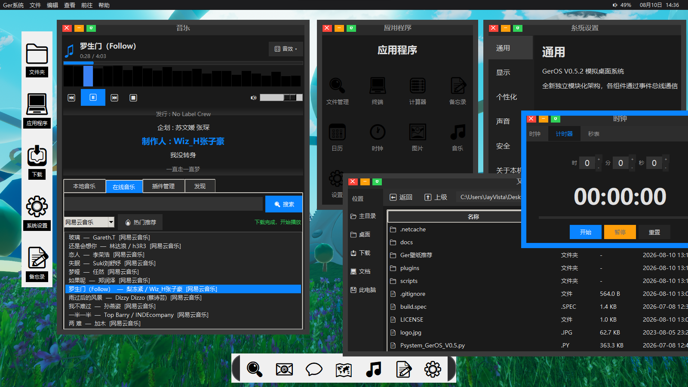
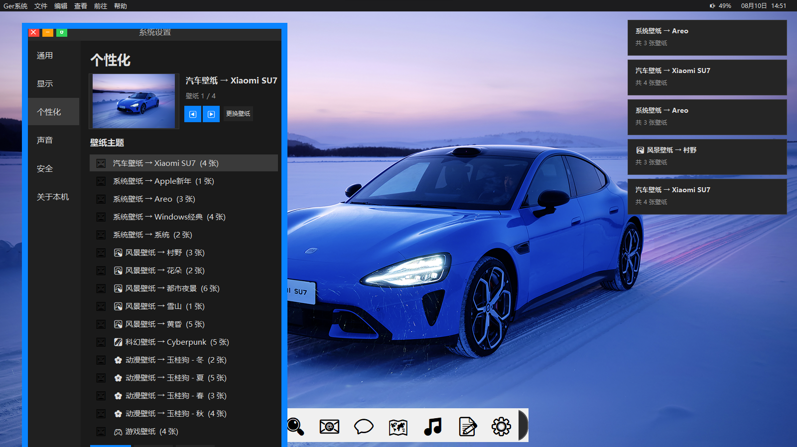

# GerOS — Python 桌面模拟操作系统

[](https://www.python.org/)
[](LICENSE)
[]()
[](https://github.com)
[](https://github.com)

> # ⚠️ 实验性原型 · 插件系统开发中
> 
> 本项目（GerOS）是一个**个人学习和概念验证（PoC）实验项目。
> > 🧑‍🎓 一个高中生的 Python 练手项目，代码粗糙，请多包涵
> ## 📮 维护说明
> 作者是一名高中在读学生，学业繁忙，项目会在周末或节假日间歇性维护。  
> Issue 和 PR 会看，但回复可能不会很及时，敬请理解 🙏

> **当前状态**：核心 UI 可运行，但音乐插件组件（JS 插件引擎）尚未闭环，**搜索和播放功能暂不可用**。  
> 欢迎围观，但**请勿用于生产环境或日常使用**。
> 
> ——这个项目是我学习 Tkinter 界面设计与 Node.js 子进程交互的练手作品。公开代码一方面是为了云端存档和版本追踪，另一方面也希望为同样在摸索 Python + Node.js 混合开发的同学提供一个可参考的实践样本。
> 一名高中生写的小玩具，代码写得不好，欢迎大家指教

---

**GerOS** 是一个基于 Python Tkinter 构建的桌面模拟操作系统，提供完整的窗口管理、音乐播放、壁纸推荐等桌面体验。灵感来源于早期 Windows 的视觉风格，内置 MusicFree 协议兼容的音乐源插件系统。


## 🖥️ 界面预览



## 🖥️ 主题切换

> 💡 支持多套壁纸主题，点击即可实时更换背景。



## 🖥️ 项目完整文件与其他资源下载
[](https://1850410485.share.123pan.cn/123pan/FaQ4vd-uVcav)

---

## 功能特性

- 🖥️ **桌面模拟环境** — 任务栏、开始菜单、窗口管理、系统托盘
- 🎵 **双引擎音乐播放器** — 本地音频文件 + 在线音源插件 (MusicFree 协议)
- 🌄 **壁纸推荐系统** — 内置 50+ 张精选壁纸，支持 6 大分类
- 🔌 **可扩展插件系统** — 支持 JSON（纯配置）和 JavaScript（Node.js 运行时）插件
- 🛠️ **内建 Node.js 运行时** — 自动解压便携 Node.js，无需用户手动安装
- ⚙️ **系统设置** — 音量、启动音效、关机音效、壁纸切换
- 📦 **支持打包为 EXE** — 通过 PyInstaller 一键生成独立可执行文件

---

## 🧪 项目状态（实验性）

GerOS 当前处于 **Alpha / 实验性开发阶段**。以下功能模块的完成情况如下：

| 模块 | 状态 | 备注 |
|------|------|------|
| 图形界面 (Tkinter) | ✅ 基本可用 | 已知高 DPI 下缩放待优化 |
| JSON 插件（静态音源） | ✅ 可用 | 已测试部分 API |
| **JS 插件引擎（Node.js 通信）** | ❌ **开发中** | **Python ↔ Node.js 子进程通信尚未调通**，音乐搜索/播放暂不可用 |
| 音效系统 | ✅ 可用 | 支持自定义 PCM WAV |
| 打包 (PyInstaller) | 🟡 部分支持 | 需手动配置 nodejs 目录 |

> 如果你感兴趣或想参与开发，欢迎提 Issue 交流，但目前**暂不接受大规模 PR**，因代码结构仍在重构中。

---

## 环境要求

| 组件 | 版本要求 | 说明 |
|------|---------|------|
| Python | ≥ 3.10 | 推荐 3.11+ |
| tkinter | 内置 | 通常随 Python 一起安装 |
| Pillow | ≥ 10.0 | 图片处理 |
| psutil | ≥ 5.9 | 系统监控 |
| Node.js | v24.14.0（内建） | 可选，支持 JS 插件 |

---

## 快速开始

### 1. 克隆项目

```bash
git clone https://github.com/JayVista/GerOS
cd GerOS
```

### 2. 安装 Python 依赖

```bash
pip install -r requirements.txt
```

### 3. 准备 Node.js 环境（可选）

JS 插件需要 Node.js 运行时。将 `node.zip` 放到项目根目录，程序首次启动会自动解压。

> 也可以手动解压到 `nodejs/` 目录，确保 `nodejs/node-v24.14.0-win-x64/node.exe` 可访问。

### 4. 启动

```bash
python Psystem_GerOS_V0.5.py
```

或直接双击 `Psystem_GerOS_V0.5.py`。

---

## 🚀 快速体验（Mock 模式）

由于 JS 插件引擎暂未完成，你可以通过以下方式预览界面效果：

1. 运行 `python Psystem_GerOS_V0.5.py`
2. 在搜索框输入任意关键词，程序会返回**模拟数据**（硬编码假列表），以演示交互逻辑。

---

## 项目结构

```
Psystem/
├── Psystem_GerOS_V0.5.py      # 主程序入口（单文件约 360KB）
├── requirements.txt           # Python 依赖
├── build.spec                 # PyInstaller 打包配置
│
├── plugins/                   # 音乐源插件
│   ├── *.json                 # JSON 插件（纯配置，无需 Node.js）
│   └── mf_plugin_*.js         # JS 插件（需 Node.js，MusicFree 协议）
│
├── Ger壁纸推荐/               # 壁纸库（6 大分类）
│   ├── 风景壁纸/               #   村野 / 花朵 / 都市夜景 / 雪山 / 黄昏
│   ├── 科幻壁纸/               #   Cyberpunk
│   ├── 动漫壁纸/               #   玉桂狗（春/夏/秋/冬）
│   ├── 游戏壁纸/               #   原神等
│   ├── 汽车壁纸/               #   Xiaomi SU7
│   └── 系统壁纸/               #   Apple / Areo / Windows 经典
│
├── scripts/                   # 开发/测试/诊断工具
│   ├── setup/                 #   环境安装脚本
│   ├── tests/                 #   功能测试脚本
│   ├── diagnostics/           #   诊断与修复工具
│   └── utils/                 #   辅助工具（Node.js 下载、VS 查找等）
│
├── docs/                      # 文档
│   └── DEBUG.md               # 调试指南
│
├── nodejs/                    # 便携 Node.js 运行时（解压后）
├── dist/GerOS.exe             # 打包好的可执行文件
│
├── Ring10.wav                 # 启动音效
├── Windows Logoff Sound.wav   # 关机音效
├── logo.jpg                   # 程序 Logo
├── system.png                 # 系统背景图
└── zh.jpg                     # 中国地图
```

---

## 插件系统

GerOS 兼容 **MusicFree** 插件协议，支持两种插件格式：

### JSON 插件（纯配置）
无需 Node.js，直接定义 API 端点即可。适合简单的搜索/播放接口。

示例：`plugins/QQ音乐.json`、`plugins/网易云音乐.json`

### JavaScript 插件（完整功能）
需要 Node.js 运行时，支持完整的搜索、获取音乐详情、歌词解析等功能。

插件文件命名格式：`mf_plugin_<时间戳>.js`

---

## 打包为 EXE

```bash
pip install pyinstaller
pyinstaller build.spec
```

打包后 `dist/GerOS.exe` 即为独立可执行文件（约 98MB，含 Node.js 和所有资源）。

---

## 常见问题

### 程序无法启动
1. 确认已安装 Python 3.10+
2. 运行 `pip install -r requirements.txt`
3. 检查 tkinter 是否可用：`python -c "import tkinter; print('OK')"`

### JS 插件不可用
1. 确保 Node.js 已解压到 `nodejs/` 目录
2. 运行 `scripts/setup/_install_deps3.py` 安装 npm 依赖
3. 查看 `docs/DEBUG.md` 获取更多诊断方法

### 音乐播放无声音
- 检查系统音量设置
- 打开 GerOS 设置面板确认音量滑块

---

## 技术架构

```
┌─────────────────────────────────────────┐
│              Tkinter GUI                │
│  ┌─────────┐ ┌──────┐ ┌────────────┐  │
│  │ 桌面模块  │ │ 音乐  │ │ 壁纸推荐   │  │
│  └─────────┘ └──┬───┘ └────────────┘  │
│                 │                       │
│  ┌──────────────▼────────────────────┐  │
│  │        系统核心 (System)           │  │
│  │   窗口管理/任务栏/设置/音效       │  │
│  └──────────────┬────────────────────┘  │
│                 │                       │
│  ┌──────────────▼────────────────────┐  │
│  │        NodeEnv 运行时管理器        │  │
│  │   自动解压/安装/调用 Node.js       │  │
│  └──────────────┬────────────────────┘  │
│                 │                       │
│  ┌──────────────▼────────────────────┐  │
│  │         插件执行引擎               │  │
│  │   JSON 插件 (HTTP) │ JS 插件      │  │
│  └───────────────────────────────────┘  │
└─────────────────────────────────────────┘
```

---

## 开发

本项目为个人兴趣项目，欢迎提交 Issue 和 PR。

### 运行测试

```bash
# 环境检测
python scripts/tests/_test_env.py

# 端到端测试
python scripts/tests/_test_e2e.py

# 插件诊断
python scripts/diagnostics/_diag_plugins.py
```

---

## 许可证

MIT License — 详见 [LICENSE](LICENSE) 文件。

---

## 致谢

- [MusicFree](https://github.com/maotoumao/MusicFreeDesktop) — 音乐插件协议参考
- 所有内置壁纸的原始版权归各自作者所有
